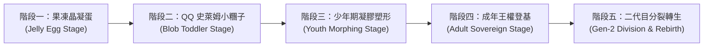
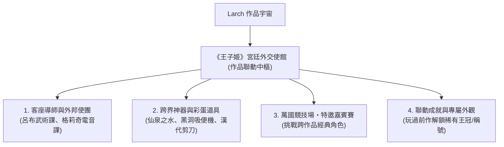

# 01. 遊戲核心設計與世界觀設定

## 一、 世界觀核心：雲端培育所與史萊姆王室原質

在浮空的「雲端王都」（Cloud Realm），每一個神聖家族都必須培育自己的王位繼承人。然而王室繼承人並非凡人之軀，而是古代生命聖樹結晶產出的**「王室史萊姆萌蛋（Royal Slime Egg）」**！

王室史萊姆一族擁有半透明的晶瑩果凍原質，**質地 QQ 彈彈（Bouncy & Squishy）**，天生沒有固定的骨骼與性別。頭頂總是頑皮地頂著一頂小小的微型黃金王冠，會隨著走動、彈跳而歡樂地晃晃悠悠（Jiggle & Bounce）。

身為「皇家御用導師（Royal Guardian）」，你將領養一團只會噗啾噗啾（Puchu~）四處彈跳的史萊姆幼苗。透過你的餵食、清潔與特訓，史萊姆果凍原質會產生神奇的**流體形態分化**——可能凝聚成英氣逼人、威風凜凜的「史萊姆王子」，也能塑形為裙襬若水滴流光的「史萊姆公主」，亦或是化為不可名狀的「液態琉璃真理君王」！

---

## 二、 角色生命週期與果凍形態成長（QQ 史萊姆演繹）

角色成長分為五大階段，每階段皆完美展現果凍史萊姆的萌動觸感：

### 1. 果凍晶凝蛋階段 (Jelly Egg Stage)
- **外觀**：半透明、會呼吸起伏的彩色凝膠蛋，蛋頂吸附著一枚迷你黃金王冠；透過半透果凍外殼，能看見內部微弱閃爍的晶核心跳。
- **QQ 互動**：
  - 戳戳撫摸：用手指輕戳（按鍵互動），整顆蛋會像布丁一樣 Duang~ Duang~ 泛起水波漣漪。
  - 音樂胎教：聽激昂進行曲會泛起氣泡，聽優雅豎琴會變得像果凍般沉靜安詳。
  - 破殼瞬間：像啵~（Pop!）的一聲果凍彈破，一隻 Q 彈水嫩的史萊姆小糰子歡快蹦出！

### 2. 幼年期 QQ 史萊姆小糰子 (Blob Toddler Stage)
- **外觀**：二頭身半透明果凍小糰子，臉上有兩顆水汪汪的黑豆眼與粉嫩腮紅，頭頂歪戴著王冠。
- **行進方式**：不是走路，而是像果凍球一樣「噗啾~ 噗啾~」彈跳前進；撞到牆壁會整隻壓扁成扁圓形，再彈性十足地回彈！
- **日常反饋**：
  - 餵食：張開果凍小嘴一口吞下整塊蛋糕，能看見食物在半透明身體裡慢慢消化溶解。
  - 排泄：伴隨「啾~」的一聲音效，從身後彈出一顆閃閃發光的固體小金球——「黃金便便」！
  - 挨打/生氣：被捏或生氣時會整隻鼓成刺蝟河豚狀，頭頂冒出 `anger` 怒氣氣泡。

### 3. 少年期凝膠塑形 (Youth Morphing Stage) - 流動性別分水嶺
- **外觀變異**：史萊姆體質開始依吸收的營養與訓練，分化出固態外裝或液態特質：
  - **傾向武力 (Might)**：果凍體質凝實變硬，宛如堅硬的橡膠，兩側延伸出結實的半透明史萊姆臂刃。
  - **傾向魅力 (Charm)**：質地變得如絲綢水滴般柔和，底部自然流淌出宛如洛可可蕾絲裙擺的果凍荷葉邊。
  - **聖泉吸收**：
    - 飲用【咒泉之水】：全身染成夢幻櫻粉色，飄出氣泡，果凍身姿自動塑形為少女姬形態！
    - 飲用【仙泉之水】：全身燃燒赤紅戰火，內部閃爍金色電芒，凝結出硬質霸王角！
    - 飲用【洛泉之水】：全身轉為水銀與月光般的流動水華，介於固態與液態之間的仙王姿態！

### 4. 成年期王權登基 (Adult Sovereign Stage) - 對戰主角
- **史萊姆·狂嵐王子**：頭戴雄獅王冠，手持方天戟或偃月刀，果凍手臂可隨意延展發動「史萊姆霸王伸展重劈」！
- **史萊姆·薔薇姬**：身著璀璨水滴晶瑩晚禮服，手持洋傘法杖或丈八蛇矛，生氣時會彈跳飛天發動「史萊姆泰山壓頂重壓」！
- **史萊姆·真理賢王**：全身完全液化，身披月光服，被敵方刀刃砍中時直接如水般分開再癒合（物理免疫）！

---

## 三、 四維人格數值與對戰風格對應

> **可行性（2026-10-06 對照官方 RPG 規格與《無雙》引擎筆記）**：四維可以用自訂變數記錄、在事件裡判斷，但**戰鬥數值吃不到**。引擎沒有爆擊率、冷卻縮減，也不會讀自訂變數；戰鬥只看等級成長曲線與裝備的攻擊、防禦、MP。右欄「對戰效果」要靠事件間接做（例如依四維分支 `hero` 到不同數值的角色），或者另做插件卡。

王子姬的內在性格直接決定其在競技場上的戰鬥風格與屬性乘數：

| 人格屬性 | 核心含義 | 日常養成方式 | 對戰效果 |
| :--- | :--- | :--- | :--- |
| **尊貴度 (Pride)** | 傲慢、自信、皇家自尊心 | 誇獎、贈送高級珠寶、穿戴奢華王冠 | 提高**暴擊率**、開局自帶「王家威壓護盾」 |
| **嬌貴度 (Spoiled)** | 任性、撒嬌、享受被侍奉 | 順從其任性要求、投餵昂貴甜食 | 縮短**技能冷卻時間 (CD)**、道具效果翻倍 |
| **武力/謀略 (Might/Wit)** | 實戰肉搏或心計戰術 | 劍術打靶、沙盤推演、禁閉苦修 | 決定**直接輸出傷害**與命中破甲率 |
| **社交魅力 (Charm)** | 傾國傾城、親和力、外交手腕 | 盛裝舞會、詩歌朗誦、修容護膚 | 提高**支援技能機率**、聯姻遺傳優質詞條機率 |

---

## 四、 電子雞經典情懷玩法的現代演繹

### 1. 「黃金便便」循環生態
- 傳統電子雞如果沒清理大便會臭氣熏天並生病死亡。
- 《王子姬》升級設計：
  - 王子姬身為王室貴冑，排泄出的是閃爍著耀眼光芒的「**黃金便便（Golden Poop）**」！
  - 玩家拿起皇家鏟子打掃後，黃金便便可拿到王國黑市或商店販賣，換取大量金幣！
  - **副作用**：但若長時間不管，育嬰室積滿便便，王子姬會被臭到「尊貴度與魅力大跌」，甚至罹患「皇家憂鬱症」，拒絕進食並吐槽玩家！

### 2. 頭頂動態心情氣泡與語音吐槽
- **狀態氣泡 (`balloon`)**：
  - 飢餓時跳出 `rice` / `apple`。
  - 想找人決鬥或發脾氣時跳出 `anger` / `swords`。
  - 被誇獎時頭頂冒出 `heart` / `sparkles`。
  - 想出鬼點子時冒出 `idea`。
- **對話框吐槽 (`presentation: "bubble"`)**：
  - 走到身邊按確認鍵，王子姬會直接在頭頂跳出對話框：
    - 「奴才！你盯著本宮看了三秒，是讚嘆於本宮的盛世美顏嗎？」
    - 「今天的松露布丁甜度差了 0.5 度，拿去倒掉重新做！」
    - 「本殿下的佩劍有些鈍了……帶我去競技場找個倒楣鬼試刀！」

### 3. 負氣出走與懸賞贖回（防放置懲罰趣味化）
- 若玩家連續數天不登入照顧，王子姬不會暴斃（避免玩家失落棄坑）。
- 代替死亡的是：**「留下一封傲嬌信，負氣離家出走」**！
- 他/她可能流落到世界各地的酒吧當洗碗工，或者被鄰國玩家「好心收留」。
- 玩家必須前往王城公告欄發布「皇家尋人懸賞」，或者支付金幣去把人「風風光光贖回」，重逢時還會伴隨哭唧唧的傲嬌道歉與羈絆加深！

### 4. 皇家穿衣鏡換裝系統（果凍紙娃娃外觀庫）

> **可行性（2026-10-06 對照官方 RPG 規格與《無雙》引擎筆記）**：**換裝範圍定為只有成年形態**（作者 2026-10-06 拍板），幼年期、少年期各只有一套造型。引擎不會把衣服疊到小人身上，每套造型＝資料庫裡一個角色＋一張四方向行走圖，換裝用 `hero` 步驟整個換掉。武器外觀不用另外畫：普攻揮出來的武器圖取自身上裝的那件武器。

在育嬰室角落設有「粉紅貝殼穿衣鏡」，小史萊姆彈跳至鏡前互動，即可一鍵更換解鎖的外觀套裝：
- 🧸 **初生軟萌睡袍裝**：穿著棉花糖小睡袍，鼻尖冒出彩色小泡泡，極致軟爛。
- 👑 **經典微型金冠裝**：原色果凍體質 + 隨彈跳歪晃的微型小金冠。
- ⚔️ **鐵血騎士小斗篷**：身披鮮紅小斗篷，背負神兵時威風凜凜。
- 👗 **洛可可水滴蕾絲裙**：粉紫雙色波浪水滴裙襬，自帶優雅傲嬌氣場。
- 🌙 **洛神月華流光服**：半透明月光水銀流體霓裳，飄浮移動、自帶月華微光。
- 🎀 **桃園三結義信物套**：頭戴張飛紅髮帶，腰間繫著關羽青龍護腰，英氣勃發。
- 武器外觀隨背包裝備即時切換（方天戟、偃月刀、蛇矛、雙股劍）。

---

## 五、 Larch「作品聯動」整合機制（跨作品宇宙聯動）

藉由 Larch 平台的「作品聯動功能」，《王子姬》不僅是一座封閉的王國，更能與 Larch 宇宙中的熱門作品（如《仙泉·香布纏》、《格莉奇與黑洞先生》、《起跑總在開始前》等）深度打通，創造令人驚豔的跨界火花：

> **可行性（2026-10-06 對照官方 RPG 規格與《無雙》引擎筆記）**：規格裡**沒有**「作品聯動」這種跨專案功能，也讀不到別部作品的存檔或成就，所以「玩過前作解鎖」**無法直接做**。替代做法：前作的結局給一組密碼，在王子姬裡用 `input` 步驟兌換。客座導師、聯動道具、競技場嘉賓都是王子姬自己的角色和道具，**做得到**，只是素材要自己做或從前作拿。

### 1. 外邦使節與客座皇家導師
- **《仙泉·香布纏》聯動**：
  - 「并州飛將」呂布親臨育嬰室擔任「特約格鬥教官」，帶領王子進行鐵血特訓（武力值暴增）。
  - 嚴湘指導宮廷裁縫，為小公主量身訂做「百花戰袍」與「漢代防身短剪」。
  - 貂蟬在後花園彈奏紫玉古琴，大幅提升社交魅力與優雅度。
- **《格莉奇與黑洞先生》聯動**：
  - AI 主播格莉奇作為「異界電子虛擬偶像」造訪王宮，讓王子姬體驗賽博電音，解鎖「傲嬌電競毒舌」專屬台詞包！

### 2. 跨作品三大聖泉與神兵靈裳（核心聯動裝備與道具）

這項聯動將《咒泉》、《仙泉》、《洛泉》宏大的「泉水重塑」世界觀，無縫嵌入《王子姬》的動態性別與對戰系統中：

#### 🌊 「三泉之水」（可重複使用・體質與性別轉化聖物）
在 Larch 背包系統中設定為**非消耗品（`bag.consumable: false`）**，玩家可在育嬰室或冒險中隨時調配王子姬的身心形態：

1. **咒泉之水 (Cursed Spring Water)** —— *源自《咒泉．三結義》《咒泉．白帝城》*

> **可行性（2026-10-06 對照官方 RPG 規格與《無雙》引擎筆記）**：**做得到**變身：背包道具設 `consumable: false`，使用時寫入「形態」變數，地圖上的 parallel／condition 事件看到變數就跑 `hero` 換角色（每張要能變身的地圖都要放這個事件）。「屬性偏向嬌貴、魅力」只能改自訂變數，戰鬥數值吃不到。

   - **世界觀典故**：桃園結義時三人同飲之泉，三十九年不曾逆轉的陰柔重塑之力。
   - **在本作效果**：非消耗品。飲用後全身泛起柔和光芒，強制將王子姬轉化為**「姬（Princess 姿態）」**，喚醒優雅細膩的心性，大幅重置並偏向嬌貴與魅力屬性。
2. **仙泉之水 (Immortal Spring Water)** —— *源自《仙泉．香布纏》*

> **可行性（2026-10-06 對照官方 RPG 規格與《無雙》引擎筆記）**：同咒泉之水。**做得到**變身；武力、尊貴度爆發只能改自訂變數。

   - **世界觀典故**：五原雪夜山洞石像滴落的神泉，十歲孩童飲下後筋骨寸斷重生，赤瞳如火，可持二十四斤神戟。
   - **在本作效果**：非消耗品。飲用後周身燃燒赤紅戰氣，強制將王子姬轉化為**「鐵血霸王王子（Prince 姿態）」**，激發無限戰意，武力 (Might) 與尊貴度 (Pride) 爆發性增長。
3. **洛泉之水 (Luo Spring Water)** —— *源自《洛泉．袁真跡》*

> **可行性（2026-10-06 對照官方 RPG 規格與《無雙》引擎筆記）**：同咒泉之水。**做得到**變身；「專屬仙音法術」可以做成換成的那個角色自帶的技能。

   - **世界觀典故**：鄴城洛神祠底封印古泉，少主袁尚受創墜入，拆骨重塑為宛若神女降世的傾國甄姬。
   - **在本作效果**：非消耗品。飲用後水霧縹緲、超凡脫俗，解鎖極其稀有的**「洛神仙姿（中性/絕美真理君主形態）」**，社交魅力 (Charm) 衝頂，解鎖專屬仙音法術。

#### ⚔️ 外邦神兵與絕世靈裳（聯動裝備）
1. **方天戟 (Sky Piercer Halberd)** —— *源自《仙泉·香布纏》呂布專屬神兵*

> **可行性（2026-10-06 對照官方 RPG 規格與《無雙》引擎筆記）**：**做得到**：武器欄、高攻擊、揮擊圖、穿戴時學會技能「無雙·鬼神斬」。**做不到**：普攻擊退（規格沒有擊退；nova 範圍寫死 5×5）。

   - **裝備槽位**：武器 (`slot: "weapon"`)，斬擊系 (`skill: "slash"`)。
   - **特效與威力**：極高的基礎物理攻擊力，揮動時釋放赤紅霸氣；附帶專屬技能「無雙·鬼神斬」，普攻具備大範圍擊退效果。
2. **偃月刀 (Crescent Blade)** —— *源自《咒泉．三結義》關二妹專屬神兵*

> **可行性（2026-10-06 對照官方 RPG 規格與《無雙》引擎筆記）**：**做得到**：武器欄、攻擊、揮擊圖、附技能「溫酒破陣斬」。**做不到**：蓄力、破甲、尊貴與忠義加成（只能改自訂變數）。

   - **世界觀典故**：「刀不能換，那就改。」三人化為女身後，原先的沉重長柄大刀不再順手。關羽毅然將刀柄截短一截、刀身削薄成修長新月，專為女身平衡改裝重鑄！
   - **裝備槽位**：武器 (`slot: "weapon"`)，斬擊系 (`skill: "slash"`)。
   - **特效與威力**：既有青龍冷豔鉅的斬岳破甲威勢，又兼具新月般的輕靈與極致手感；附帶專屬技能「溫酒破陣斬」，蓄力重劈破甲且正氣凜然，尊貴度與忠義值加成顯著。
3. **丈八蛇矛 (Serpent Spear)** —— *源自《咒泉．三結義》張三妹專屬神兵*

> **可行性（2026-10-06 對照官方 RPG 規格與《無雙》引擎筆記）**：**做得到**：武器欄、攻擊、揮擊圖、附技能「燕人雷霆刺」。**做不到**：攻速、連續貫穿、吼退。突進可以改用角色技能的 `dash`，但那是綁角色不是綁武器。

   - **世界觀典故**：同為《三結義》中因應女身改裝的神兵，將原本過長的丈八矛桿重新截短收束、重新調校握位配重，化長為巧，專為女身狂暴發力而生！
   - **裝備槽位**：武器 (`slot: "weapon"`)，斬擊/突刺系 (`skill: "slash"`)。
   - **特效與威力**：矛頭如游蛇曲動，突刺攻速極快且帶連續貫穿判定；附帶專屬技能「燕人雷霆刺」，以雷霆萬鈞之勢突進並吼退周遭敵人，大幅提升狂暴輸出與攻速。
4. **雌雄雙股劍 (Twin Swords of Male & Female)** —— *源自《咒泉．三結義》大姐劉備專屬神兵*

> **可行性（2026-10-06 對照官方 RPG 規格與《無雙》引擎筆記）**：**做得到**：武器欄、防禦加成、揮擊圖、附技能。**做不到**：裝備加魅力；技能附帶護盾（技能效果只有 flame／ice／spark／holy／heal／meteor，護盾只能做成背包道具效果或角色技能）。

   - **世界觀典故**：一雌一雄、雙劍合璧，象徵桃園同心之誓與仁德仁心。化女身後劍法愈發飄逸靈秀，雙劍流舞動宛若驚鴻，攻守一體。
   - **裝備槽位**：武器 (`slot: "weapon"`)，雙刀斬擊系 (`skill: "slash"`)。
   - **特效與威力**：全能平衡之兵，大幅提升防禦力與社交魅力 (Charm)；附帶專屬技能「桃園同心斬」，雙劍十字交錯斬出金光，傷敵的同時為自身與隊友提供庇護護盾與氣血回復！
5. **關羽的腰帶 (Guan Yu's Belt)** —— *源自《咒泉》二妹通關信物*

> **可行性（2026-10-06 對照官方 RPG 規格與《無雙》引擎筆記）**：**做得到**：防具欄、防禦。**做不到**：HP 上限（裝備沒有 HP 欄位）、「義薄雲天」保留 1 HP 加無敵（沒有被動技能機制）。**防具欄只有一格**，跟頭巾、月光服三選一。

   - **世界觀典故**：三十九年風霜見證，麥城雪盡後留下的半截腰帶。繡紋如青龍盤繞，內蘊堅定不移的守護意念。
   - **裝備槽位**：防具/腰帶 (`slot: "armor"`)。
   - **特效與威力**：大幅強化物理防禦與生命上限；附帶被動技能「義薄雲天」，當王子姬承受致命傷害時，強制保留 1 點氣血並觸發 3 秒無敵金身！
6. **張飛的頭巾 (Zhang Fei's Bandana / 紅髮帶)** —— *源自《咒泉》三妹通關信物*

> **可行性（2026-10-06 對照官方 RPG 規格與《無雙》引擎筆記）**：**做得到**：攻擊加成（裝備可以加攻擊）。**做不到**：爆擊、冷卻縮減、「狂歌破陣」低血加速。**也是防具**，跟腰帶、月光服三選一。

   - **世界觀典故**：閬中烈火遺珍，鮮紅如赤焰的髮帶。曾束起張三妹於萬馬軍中咆哮衝鋒的狂野青絲。
   - **裝備槽位**：防具/頭飾 (`slot: "armor"`)。
   - **特效與威力**：極致進攻型防具，大幅提升暴擊傷害與冷卻縮減 (CDR)；附帶被動技能「狂歌破陣」，生命值越低攻速與暴擊率越高！
7. **劉備的金釵 (Liu Bei's Golden Hairpin)** —— *源自《咒泉》大姐通關信物*

> **可行性（2026-10-06 對照官方 RPG 規格與《無雙》引擎筆記）**：**做得到**：飾品欄、穿戴時學會回血技能。**做不到**：魔防、戰鬥中持續回復、外交與決鬥加成。

   - **世界觀典故**：沉於桃園溪谷水底三十九年的金釵，見證三個男人化為三姊妹的永恆誓約，亦是打開時空之門的關鍵之匙。
   - **裝備槽位**：飾品 (`slot: "accessory"`)。
   - **特效與威力**：靈性護體之寶，大幅提升魔法防禦與社交魅力 (Charm)；附帶被動技能「仁澤流芳」，戰鬥中定期為全隊持續回復氣血與法力，並顯著提升外交與決鬥說服成功率！
8. **月光服 (Moonlight Robe)** —— *源自《洛泉．袁真跡》甄姬月下霓裳*

> **可行性（2026-10-06 對照官方 RPG 規格與《無雙》引擎筆記）**：**做得到**：防具欄、防禦。**做不到**：閃避、「洛神凝睇」讓對手跳過首回合。**也是防具**，跟腰帶、頭巾三選一。

   - **裝備槽位**：防具 (`slot: "armor"`)。
   - **特效與威力**：水霧般飄逸的銀藍月華絲裳，大幅提高防禦與閃避率；被動技能「洛神凝睇」讓對手開局有極高機率被其絕世風華震懾而跳過首回合攻擊。

### 3. 宮廷競技場・特邀嘉賓挑戰賽
- 每週邀請一位跨作品英雄擔任「競技場擂主」（如手持方天畫戟的呂布、手持木弓的呂荃）。
- 玩家派出自己培育的成熟期王子姬前去打擂，獲勝可登錄全服「屠龍/降將名人堂」。

