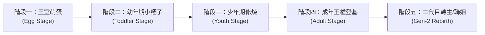
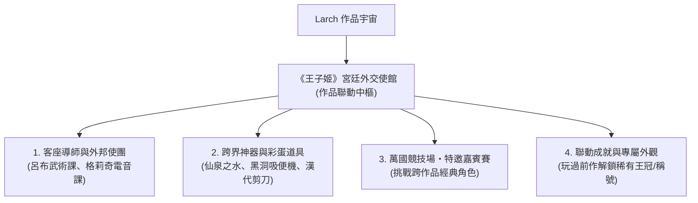

# 01. 遊戲核心設計與世界觀設定

## 一、 世界觀核心：雲端培育所與王權爭霸

在浮空的「雲端王都」（Cloud Realm），每一個神聖家族都必須培育自己的王位繼承人。然而王室繼承人並非自然誕生，而是由古代聖樹產出的「王室萌蛋」（Royal Egg）。

萌蛋內蘊藏著純淨的原初王家靈魂，沒有預設的性別、外觀或性格。玩家身為「皇家御用導師（Royal Guardian）」，必須肩負起將一顆只會咕嚕嚕滾動的蛋，拉拔成具備尊貴氣魄、足以代表王國登上王座的頂級君王。

但在這個過程中，孩子可能變得無比傲嬌、刁鑽挑剔、拉出閃閃發光的黃金便便，甚至因為你的特訓方向，逐漸塑造成勇猛的「王子」、華貴優雅的「公主」、抑或是掌握雙面特質的「神秘君主」。

---

## 二、 角色生命週期與成長階段

角色成長分為四大階段：

### 1. 萌蛋階段 (Egg Stage)
- **外觀**：一顆戴著小王冠、會隨心跳微微震動跳躍的彩色蛋。
- **互動**：
  - 輕輕敲擊（撫摸）：提升心情與安全感。
  - 保溫與音樂：聽古典宮廷樂或戰場進行曲，初次影響隱藏傾向。
  - 破殼契機：累積足夠照料點數後，蛋殼碎裂，蹦出幼兒期小王子姬！

### 2. 幼年期小糰子 (Toddler Stage)
- **外觀**：二頭身 Q 版小糰子，穿著寬大的王室睡袍。
- **特徵**：性別尚處於完全混沌狀態，會咿咿呀呀說話，開始產生飲食與作息偏好。
- **主要工作**：學會自己上廁所（清理「黃金便便」）、戒掉半夜啼哭、初步性格塑型。

### 3. 少年期修煉 (Youth Stage) - 關鍵分水嶺
- **外觀**：體型稍微拔高，外表開始顯現明顯傾向（英氣短髮、披肩長髮、或精緻中性裝束）。
- **特徵**：正式進入皇家教育課程（課表系統）。
- **轉化關鍵**：
  - 偏向 **陽剛/力量 (Might)**：經常進行重劍格鬥、野外拉練、吃烤肉 → 朝「王子形態 (Prince Path)」演化。
  - 偏向 **陰柔/魅力 (Charm)**：經常進行皇家宮廷舞、刺繡插花、品嘗法式甜點 → 朝「公主形態 (Princess Path)」演化。
  - 偏向 **智略/中庸 (Wit & Balance)**：博覽群書、棋藝對決、煉金術實驗 → 解鎖「中性賢王 (Sage Monarch)」。
  - 偏向 **極端雙向 (High Might & High Charm)**：解鎖傳奇「雙面王姬 (Dual Sovereign)」形態。

### 4. 成年期登基 (Adult Stage) - 線上對戰主力
- **外觀**：華麗全副武裝的王子 / 裙襬流光的公主 / 雙姿態切換的王者。
- **開放玩法**：
  - 離開專屬育嬰室，踏入「王城中央廣場（連線公共大地圖）」。
  - 參加「宮廷競技場」，與其他玩家的成年王子姬展開榮耀決鬥。
  - 開放「王室婚約（聯姻）」，留下子嗣並產生二代目蛋。

---

## 三、 四維人格數值與對戰風格對應

王子姬的內在性格直接決定其在競技場上的戰鬥風格與屬性乘數：

| 人格屬性 | 核心含義 | 日常養成方式 | 對戰效果 |
| :--- | :--- | :--- | :--- |
| **尊貴度 (Pride)** | 傲慢、自信、皇家自尊心 | 誇獎、贈送高級珠寶、穿戴奢華王冠 | 提高**暴擊率**、開局自帶「王家威壓護盾」 |
| **嬌貴度 (Spoiled)** | 任性、撒嬌、享受被侍奉 | 順從其任性要求、投餵昂貴甜食 | 縮短**技能冷卻時間 (CD)**、道具效果翻倍 |
| **武力/謀略 (Might/Wit)** | 實戰肉搏或心計戰術 | 劍術打靶、沙盤推演、禁閉苦修 | 決定**直接輸出傷害**與命中破甲率 |
| **社交魅力 (Charm)** | 傾國傾城、親和力、外交手腕 | 盛裝舞會、詩歌朗誦、修容護膚 | 提高**支援技能機率**、聯姻遺傳優質詞條機率 |

---

## 四、 電子雞經典情懷玩法的現代演繹

### 1. 「黃金便便」循環生態
- 傳統電子雞如果沒清理大便會臭氣熏天並生病死亡。
- 《王子姬》升級設計：
  - 王子姬身為王室貴冑，排泄出的是閃爍著耀眼光芒的「**黃金便便（Golden Poop）**」！
  - 玩家拿起皇家鏟子打掃後，黃金便便可拿到王國黑市或商店販賣，換取大量金幣！
  - **副作用**：但若長時間不管，育嬰室積滿便便，王子姬會被臭到「尊貴度與魅力大跌」，甚至罹患「皇家憂鬱症」，拒絕進食並吐槽玩家！

### 2. 頭頂動態心情氣泡與語音吐槽
- **狀態氣泡 (`balloon`)**：
  - 飢餓時跳出 `rice` / `apple`。
  - 想找人決鬥或發脾氣時跳出 `anger` / `swords`。
  - 被誇獎時頭頂冒出 `heart` / `sparkles`。
  - 想出鬼點子時冒出 `idea`。
- **對話框吐槽 (`presentation: "bubble"`)**：
  - 走到身邊按確認鍵，王子姬會直接在頭頂跳出對話框：
    - 「奴才！你盯著本宮看了三秒，是讚嘆於本宮的盛世美顏嗎？」
    - 「今天的松露布丁甜度差了 0.5 度，拿去倒掉重新做！」
    - 「本殿下的佩劍有些鈍了……帶我去競技場找個倒楣鬼試刀！」

### 3. 負氣出走與懸賞贖回（防放置懲罰趣味化）
- 若玩家連續數天不登入照顧，王子姬不會暴斃（避免玩家失落棄坑）。
- 代替死亡的是：**「留下一封傲嬌信，負氣離家出走」**！
- 他/她可能流落到世界各地的酒吧當洗碗工，或者被鄰國玩家「好心收留」。
- 玩家必須前往王城公告欄發布「皇家尋人懸賞」，或者支付金幣去把人「風風光光贖回」，重逢時還會伴隨哭唧唧的傲嬌道歉與羈絆加深！

---

## 五、 Larch「作品聯動」整合機制（跨作品宇宙聯動）

藉由 Larch 平台的「作品聯動功能」，《王子姬》不僅是一座封閉的王國，更能與 Larch 宇宙中的熱門作品（如《仙泉·香布纏》、《格莉奇與黑洞先生》、《起跑總在開始前》等）深度打通，創造令人驚豔的跨界火花：

### 1. 外邦使節與客座皇家導師
- **《仙泉·香布纏》聯動**：
  - 「并州飛將」呂布親臨育嬰室擔任「特約格鬥教官」，帶領王子進行鐵血特訓（武力值暴增）。
  - 嚴湘指導宮廷裁縫，為小公主量身訂做「百花戰袍」與「漢代防身短剪」。
  - 貂蟬在後花園彈奏紫玉古琴，大幅提升社交魅力與優雅度。
- **《格莉奇與黑洞先生》聯動**：
  - AI 主播格莉奇作為「異界電子虛擬偶像」造訪王宮，讓王子姬體驗賽博電音，解鎖「傲嬌電競毒舌」專屬台詞包！

### 2. 跨作品三大聖泉與神兵靈裳（核心聯動裝備與道具）

這項聯動將《咒泉》、《仙泉》、《洛泉》宏大的「泉水重塑」世界觀，無縫嵌入《王子姬》的動態性別與對戰系統中：

#### 🌊 「三泉之水」（可重複使用・體質與性別轉化聖物）
在 Larch 背包系統中設定為**非消耗品（`bag.consumable: false`）**，玩家可在育嬰室或冒險中隨時調配王子姬的身心形態：

1. **咒泉之水 (Cursed Spring Water)** —— *源自《咒泉．三結義》《咒泉．白帝城》*
   - **世界觀典故**：桃園結義時三人同飲之泉，三十九年不曾逆轉的陰柔重塑之力。
   - **在本作效果**：非消耗品。飲用後全身泛起柔和光芒，強制將王子姬轉化為**「姬（Princess 姿態）」**，喚醒優雅細膩的心性，大幅重置並偏向嬌貴與魅力屬性。
2. **仙泉之水 (Immortal Spring Water)** —— *源自《仙泉．香布纏》*
   - **世界觀典故**：五原雪夜山洞石像滴落的神泉，十歲孩童飲下後筋骨寸斷重生，赤瞳如火，可持二十四斤神戟。
   - **在本作效果**：非消耗品。飲用後周身燃燒赤紅戰氣，強制將王子姬轉化為**「鐵血霸王王子（Prince 姿態）」**，激發無限戰意，武力 (Might) 與尊貴度 (Pride) 爆發性增長。
3. **洛泉之水 (Luo Spring Water)** —— *源自《洛泉．袁真跡》*
   - **世界觀典故**：鄴城洛神祠底封印古泉，少主袁尚受創墜入，拆骨重塑為宛若神女降世的傾國甄姬。
   - **在本作效果**：非消耗品。飲用後水霧縹緲、超凡脫俗，解鎖極其稀有的**「洛神仙姿（中性/絕美真理君主形態）」**，社交魅力 (Charm) 衝頂，解鎖專屬仙音法術。

#### ⚔️ 外邦神兵與絕世靈裳（聯動裝備）
1. **方天戟 (Sky Piercer Halberd)** —— *源自《仙泉·香布纏》呂布專屬神兵*
   - **裝備槽位**：武器 (`slot: "weapon"`)，斬擊系 (`skill: "slash"`)。
   - **特效與威力**：極高的基礎物理攻擊力，揮動時釋放赤紅霸氣；附帶專屬技能「無雙·鬼神斬」，普攻具備大範圍擊退效果。
2. **偃月刀 (Crescent Blade)** —— *源自《咒泉．三結義》關二妹專屬神兵*
   - **世界觀典故**：「刀不能換，那就改。」三人化為女身後，原先的沉重長柄大刀不再順手。關羽毅然將刀柄截短一截、刀身削薄成修長新月，專為女身平衡改裝重鑄！
   - **裝備槽位**：武器 (`slot: "weapon"`)，斬擊系 (`skill: "slash"`)。
   - **特效與威力**：既有青龍冷豔鉅的斬岳破甲威勢，又兼具新月般的輕靈與極致手感；附帶專屬技能「溫酒破陣斬」，蓄力重劈破甲且正氣凜然，尊貴度與忠義值加成顯著。
3. **丈八蛇矛 (Serpent Spear)** —— *源自《咒泉．三結義》張三妹專屬神兵*
   - **世界觀典故**：同為《三結義》中因應女身改裝的神兵，將原本過長的丈八矛桿重新截短收束、重新調校握位配重，化長為巧，專為女身狂暴發力而生！
   - **裝備槽位**：武器 (`slot: "weapon"`)，斬擊/突刺系 (`skill: "slash"`)。
   - **特效與威力**：矛頭如游蛇曲動，突刺攻速極快且帶連續貫穿判定；附帶專屬技能「燕人雷霆刺」，以雷霆萬鈞之勢突進並吼退周遭敵人，大幅提升狂暴輸出與攻速。
4. **雌雄雙股劍 (Twin Swords of Male & Female)** —— *源自《咒泉．三結義》大姐劉備專屬神兵*
   - **世界觀典故**：一雌一雄、雙劍合璧，象徵桃園同心之誓與仁德仁心。化女身後劍法愈發飄逸靈秀，雙劍流舞動宛若驚鴻，攻守一體。
   - **裝備槽位**：武器 (`slot: "weapon"`)，雙刀斬擊系 (`skill: "slash"`)。
   - **特效與威力**：全能平衡之兵，大幅提升防禦力與社交魅力 (Charm)；附帶專屬技能「桃園同心斬」，雙劍十字交錯斬出金光，傷敵的同時為自身與隊友提供庇護護盾與氣血回復！
5. **關羽的腰帶 (Guan Yu's Belt)** —— *源自《咒泉》二妹通關信物*
   - **世界觀典故**：三十九年風霜見證，麥城雪盡後留下的半截腰帶。繡紋如青龍盤繞，內蘊堅定不移的守護意念。
   - **裝備槽位**：防具/腰帶 (`slot: "armor"`)。
   - **特效與威力**：大幅強化物理防禦與生命上限；附帶被動技能「義薄雲天」，當王子姬承受致命傷害時，強制保留 1 點氣血並觸發 3 秒無敵金身！
6. **張飛的頭巾 (Zhang Fei's Bandana / 紅髮帶)** —— *源自《咒泉》三妹通關信物*
   - **世界觀典故**：閬中烈火遺珍，鮮紅如赤焰的髮帶。曾束起張三妹於萬馬軍中咆哮衝鋒的狂野青絲。
   - **裝備槽位**：防具/頭飾 (`slot: "armor"`)。
   - **特效與威力**：極致進攻型防具，大幅提升暴擊傷害與冷卻縮減 (CDR)；附帶被動技能「狂歌破陣」，生命值越低攻速與暴擊率越高！
7. **劉備的金釵 (Liu Bei's Golden Hairpin)** —— *源自《咒泉》大姐通關信物*
   - **世界觀典故**：沉於桃園溪谷水底三十九年的金釵，見證三個男人化為三姊妹的永恆誓約，亦是打開時空之門的關鍵之匙。
   - **裝備槽位**：飾品 (`slot: "accessory"`)。
   - **特效與威力**：靈性護體之寶，大幅提升魔法防禦與社交魅力 (Charm)；附帶被動技能「仁澤流芳」，戰鬥中定期為全隊持續回復氣血與法力，並顯著提升外交與決鬥說服成功率！
8. **月光服 (Moonlight Robe)** —— *源自《洛泉．袁真跡》甄姬月下霓裳*
   - **裝備槽位**：防具 (`slot: "armor"`)。
   - **特效與威力**：水霧般飄逸的銀藍月華絲裳，大幅提高防禦與閃避率；被動技能「洛神凝睇」讓對手開局有極高機率被其絕世風華震懾而跳過首回合攻擊。

### 3. 宮廷競技場・特邀嘉賓挑戰賽
- 每週邀請一位跨作品英雄擔任「競技場擂主」（如手持方天畫戟的呂布、手持木弓的呂荃）。
- 玩家派出自己培育的成熟期王子姬前去打擂，獲勝可登錄全服「屠龍/降將名人堂」。

