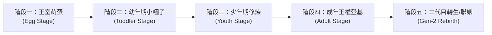

# 01. 遊戲核心設計與世界觀設定

## 一、 世界觀核心：雲端培育所與王權爭霸

在浮空的「雲端王都」（Cloud Realm），每一個神聖家族都必須培育自己的王位繼承人。然而王室繼承人並非自然誕生，而是由古代聖樹產出的「王室萌蛋」（Royal Egg）。

萌蛋內蘊藏著純淨的原初王家靈魂，沒有預設的性別、外觀或性格。玩家身為「皇家御用導師（Royal Guardian）」，必須肩負起將一顆只會咕嚕嚕滾動的蛋，拉拔成具備尊貴氣魄、足以代表王國登上王座的頂級君王。

但在這個過程中，孩子可能變得無比傲嬌、刁鑽挑剔、拉出閃閃發光的黃金便便，甚至因為你的特訓方向，逐漸塑造成勇猛的「王子」、華貴優雅的「公主」、抑或是掌握雙面特質的「神秘君主」。

---

## 二、 角色生命週期與成長階段

角色成長分為四大階段：

### 1. 萌蛋階段 (Egg Stage)
- **外觀**：一顆戴著小王冠、會隨心跳微微震動跳躍的彩色蛋。
- **互動**：
  - 輕輕敲擊（撫摸）：提升心情與安全感。
  - 保溫與音樂：聽古典宮廷樂或戰場進行曲，初次影響隱藏傾向。
  - 破殼契機：累積足夠照料點數後，蛋殼碎裂，蹦出幼兒期小王子姬！

### 2. 幼年期小糰子 (Toddler Stage)
- **外觀**：二頭身 Q 版小糰子，穿著寬大的王室睡袍。
- **特徵**：性別尚處於完全混沌狀態，會咿咿呀呀說話，開始產生飲食與作息偏好。
- **主要工作**：學會自己上廁所（清理「黃金便便」）、戒掉半夜啼哭、初步性格塑型。

### 3. 少年期修煉 (Youth Stage) - 關鍵分水嶺
- **外觀**：體型稍微拔高，外表開始顯現明顯傾向（英氣短髮、披肩長髮、或精緻中性裝束）。
- **特徵**：正式進入皇家教育課程（課表系統）。
- **轉化關鍵**：
  - 偏向 **陽剛/力量 (Might)**：經常進行重劍格鬥、野外拉練、吃烤肉 → 朝「王子形態 (Prince Path)」演化。
  - 偏向 **陰柔/魅力 (Charm)**：經常進行皇家宮廷舞、刺繡插花、品嘗法式甜點 → 朝「公主形態 (Princess Path)」演化。
  - 偏向 **智略/中庸 (Wit & Balance)**：博覽群書、棋藝對決、煉金術實驗 → 解鎖「中性賢王 (Sage Monarch)」。
  - 偏向 **極端雙向 (High Might & High Charm)**：解鎖傳奇「雙面王姬 (Dual Sovereign)」形態。

### 4. 成年期登基 (Adult Stage) - 線上對戰主力
- **外觀**：華麗全副武裝的王子 / 裙襬流光的公主 / 雙姿態切換的王者。
- **開放玩法**：
  - 離開專屬育嬰室，踏入「王城中央廣場（連線公共大地圖）」。
  - 參加「宮廷競技場」，與其他玩家的成年王子姬展開榮耀決鬥。
  - 開放「王室婚約（聯姻）」，留下子嗣並產生二代目蛋。

---

## 三、 四維人格數值與對戰風格對應

王子姬的內在性格直接決定其在競技場上的戰鬥風格與屬性乘數：

| 人格屬性 | 核心含義 | 日常養成方式 | 對戰效果 |
| :--- | :--- | :--- | :--- |
| **尊貴度 (Pride)** | 傲慢、自信、皇家自尊心 | 誇獎、贈送高級珠寶、穿戴奢華王冠 | 提高**暴擊率**、開局自帶「王家威壓護盾」 |
| **嬌貴度 (Spoiled)** | 任性、撒嬌、享受被侍奉 | 順從其任性要求、投餵昂貴甜食 | 縮短**技能冷卻時間 (CD)**、道具效果翻倍 |
| **武力/謀略 (Might/Wit)** | 實戰肉搏或心計戰術 | 劍術打靶、沙盤推演、禁閉苦修 | 決定**直接輸出傷害**與命中破甲率 |
| **社交魅力 (Charm)** | 傾國傾城、親和力、外交手腕 | 盛裝舞會、詩歌朗誦、修容護膚 | 提高**支援技能機率**、聯姻遺傳優質詞條機率 |

---

## 四、 電子雞經典情懷玩法的現代演繹

### 1. 「黃金便便」循環生態
- 傳統電子雞如果沒清理大便會臭氣熏天並生病死亡。
- 《王子姬》升級設計：
  - 王子姬身為王室貴冑，排泄出的是閃爍著耀眼光芒的「**黃金便便（Golden Poop）**」！
  - 玩家拿起皇家鏟子打掃後，黃金便便可拿到王國黑市或商店販賣，換取大量金幣！
  - **副作用**：但若長時間不管，育嬰室積滿便便，王子姬會被臭到「尊貴度與魅力大跌」，甚至罹患「皇家憂鬱症」，拒絕進食並吐槽玩家！

### 2. 頭頂動態心情氣泡與語音吐槽
- **狀態氣泡 (`balloon`)**：
  - 飢餓時跳出 `rice` / `apple`。
  - 想找人決鬥或發脾氣時跳出 `anger` / `swords`。
  - 被誇獎時頭頂冒出 `heart` / `sparkles`。
  - 想出鬼點子時冒出 `idea`。
- **對話框吐槽 (`presentation: "bubble"`)**：
  - 走到身邊按確認鍵，王子姬會直接在頭頂跳出對話框：
    - 「奴才！你盯著本宮看了三秒，是讚嘆於本宮的盛世美顏嗎？」
    - 「今天的松露布丁甜度差了 0.5 度，拿去倒掉重新做！」
    - 「本殿下的佩劍有些鈍了……帶我去競技場找個倒楣鬼試刀！」

### 3. 負氣出走與懸賞贖回（防放置懲罰趣味化）
- 若玩家連續數天不登入照顧，王子姬不會暴斃（避免玩家失落棄坑）。
- 代替死亡的是：**「留下一封傲嬌信，負氣離家出走」**！
- 他/她可能流落到世界各地的酒吧當洗碗工，或者被鄰國玩家「好心收留」。
- 玩家必須前往王城公告欄發布「皇家尋人懸賞」，或者支付金幣去把人「風風光光贖回」，重逢時還會伴隨哭唧唧的傲嬌道歉與羈絆加深！
