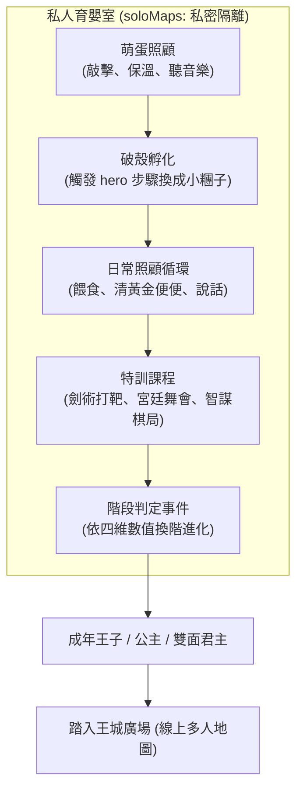
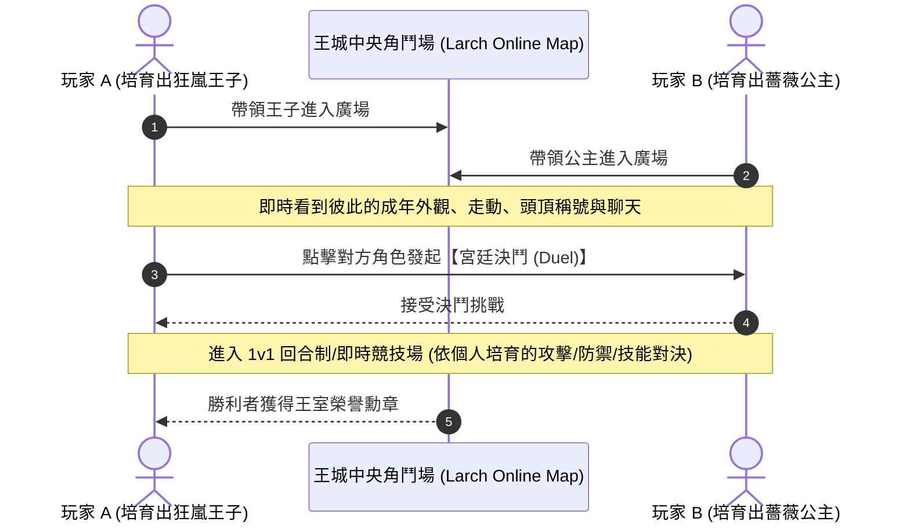

# 02. Larch RPG 技術架構與連線對戰可行性分析

深入探討在 **Larch Story Studio (RPG 2.0)** 體系下，如何具體實現「單機養成訓練」與「線上多人對戰」的結合架構。

---

## 一、 Larch RPG 引擎的本質與能力邊界

在規劃遊戲功能前，必須清楚 Larch RPG 底層的運作契約（基於官方規格與實測經驗）：

### 1. 單機客戶端本質 (Client-side Authority)
- **變數、背包與存檔**：每個玩家的劇情進度、背包道具、數值變數（如 `pride`, `spoiled` 等）與存檔槽，**完全存放在各自的本機瀏覽器/帳號中**。
- **好處**：單機養成極為順暢、離線可用、完全不受網路延遲干擾，且能隨心所欲透過事件自訂複雜的數值邏輯。

### 2. 連線層能力 (Larch Native Multiplayer)
- 透過 `larch_rpg_settings` 的 `online` 區塊開啟多人模式：
  - `enabled: true`
  - `channelMode: "auto"`（每頻道 50 人，超額自動分流）
  - `chat: "free"`（自由文字聊天）與表情符號氣泡
  - `nameTags: true`（頭頂顯示名字與稱號）
  - `social.duel: true`（**原生決鬥支援！同地圖玩家可互發 1v1 挑戰**）
  - `soloMaps: ["map_nursery"]`（**私密地圖隔離**，指定地圖內隱藏其他玩家）
- **連線層限制**：
  - 原生連線**只同步角色位置、行走動作、外觀、聊天、表情與發起決鬥**。
  - **無法直接跨連線修改對方的變數或偷取對方背包道具**（除非自建後端 API 或自製外掛插件）。

---

## 二、 單機培育循環的 Larch 實作方案

單機培育完全在 Larch 原生事件與變數系統內完成，體驗如絲般順滑：

### 1. 育嬰室私密空間 (`soloMaps`)
- 將育嬰室地圖加入 `online.soloMaps`，這樣其他連線玩家不會誤闖你的育嬰房，保持養寵物的私密安寧。

### 2. 性別與外觀的動態更換 (`hero` 步驟)
- Larch 的事件步驟 `kind: "hero"` 是動態養成的核心利器：
  - 一行指令即可將主角模型、走路圖集、等級曲線、技能清單直接無縫切換！
  - 準備不同階段與傾向的角色資料庫（如 `hero_egg`, `hero_toddler`, `hero_prince_valiant`, `hero_princess_rose`, `hero_monarch_dual`）。
  - 當數值累積達標，事件執行 `hero: "hero_prince_valiant"`，小糰子瞬間換上帥氣的披風與佩劍，完成動態進化！

### 3. 黃金便便與日常互動
- **便便生成**：利用平行事件（`trigger: "parallel"`）搭配 `wait` 計時器，每隔一段時間隨機在房間地板鋪設便便事件。
- **清理收穫**：主角走到便便格按空白鍵/J 鍵，觸發打掃動作（`screen: shake` + `sound: chime`），移除便便並執行 `item: "golden_poop"`，進背包當作硬幣儲備！
- **頭頂氣泡與傲嬌吐槽**：
  - 狀態氣泡：`balloon: { icon: "anger", target: "self" }`。
  - 吐槽對話：`dialogue: { presentation: "bubble", text: "奴才！快扶本宮起來！" }`，對話框直接浮在角色頭頂。

---

## 三、 線上多人對戰與社交的 Larch 實作架構

在不需架設額外伺服器的前提下，最大化運用 Larch 現有連線架構：

### 1. 線上萬國角鬥場 (Palace Arena & Central Plaza)
- **共用公開地圖**：不設 `soloMaps`，讓所有在線玩家齊聚一堂。
- **外觀展示秀**：玩家精心培育出的「極限特化王子」或「華麗禮服公主」在廣場遊弋，所有人皆能看見其獨特行走姿態。
- **1v1 玩家決鬥 (`social.duel = true`)**：
  - Larch 內建之決鬥機制，玩家只要在同一地圖點擊另一名玩家，即可發出 Duel 請求。
  - 雙方攜帶各自在單機階段培育出的等級、HP、裝備、技能與四維加成進行戰鬥！

### 2. 跨玩家血統聯姻：王室密令（Gene Code）方案
> 解決 Larch 無法跨客戶端寫入資料庫的經典方案（致敬實體電子雞的紅外線/密碼聯姻）。

- **機制流程**：
  1. 玩家 A 的王子成年後，前往大教堂選擇「頒布王室婚約」。
  2. 系統根據玩家 A 的四維屬性與外觀代碼，生成一串 **6~8 碼的「王室密令」**（例如：`PR-89A-PRD7`）。
  3. 玩家 A 可將這串代碼分享在連線聊天室、Discord 或社群。
  4. 玩家 B 在自己的教堂輸入這串代碼（使用 Larch 的 `action.kind: "input"`）。
  5. 系統解碼驗證後，立即播放盛大的王室聯姻婚禮過場！
  6. 玩家 B 獲得一顆**「第二代王室神聖之蛋」**，繼承雙方的優秀基因詞條（如開局尊貴度+20、解鎖稀有毛色）！

### 3. 全服世界 Boss（反叛軍與魔龍來襲）
- 在線上大地圖（如「王國邊境要塞」）設置巨大 Boss 事件。
- 所有人同處一張地圖，可使用 `combat: "action"` 共同圍攻 Boss；或各自挑戰進入副本，在連線頻道中實時通報戰況，合力抵禦王國危機。

---

## 四、 總結：架構可行性評估

| 構想模組 | Larch 原生支援度 | 實作策略 | 評估結果 |
| :--- | :---: | :--- | :---: |
| **萌蛋動態性別與外觀養成** | ⭐⭐⭐⭐⭐ (極高) | 變數系統 + `hero` 角色換裝/切換 | 💯 完美原生契合 |
| **電子雞便便/餵食/氣泡** | ⭐⭐⭐⭐⭐ (極高) | 平行計時事件 + `balloon` 氣泡 + 掉落物 | 💯 沉浸感十足 |
| **線上大廳與玩家外觀展示** | ⭐⭐⭐⭐⭐ (極高) | `online.enabled` + 自動頻道分流 | 💯 原生開箱即用 |
| **1v1 線上多人對戰 (PvP)** | ⭐⭐⭐⭐⭐ (極高) | `social.duel = true` 決鬥挑戰 | 💯 原生對戰模組支援 |
| **血統聯姻與二代目培育** | ⭐⭐⭐⭐ (極佳) | 密碼輸入系統 (`input` action) 基因交換 | 💡 復古又零維護成本 |
| **全自動跨服偷菜/掠奪** | ⭐⭐ (受限) | 轉化為「隨機拜訪模擬公使館」或密碼交互 | 🔧 可優雅轉化成單機隨機事件 |
| **Larch 作品聯動系統** | ⭐⭐⭐⭐⭐ (極高) | 共享素材庫、跨作品密令、客座 NPC 與外派事件 | 🌟 打造跨遊戲共享宇宙 |

---

## 五、 Larch「作品聯動」的技術實作路徑

在 Larch 架構下，作品聯動可從以下三種層次無縫落地：

1. **資產與角色共享（Asset Pack & Character Import）**：
   - 透過 Larch 的 `Asset Packs` 或共用圖集，將其他作品的角色行走小人（Walking Sprites）與立繪匯入《王子姬》的 RPG 資料庫中（作為 `actors` 註冊為 NPC 或客座教官）。
2. **跨作品密碼與成就驗證（Crossover Code Exchange）**：
   - 利用 `action.kind: "input"`，玩家輸入其他作品通關結尾給予的專屬彩蛋碼（例如：《仙泉無雙》擊殺百人獲得的「霸王兵符」碼），在《王子姬》兌換「方天畫戟」裝備或「仙泉之水」道具。
3. **平台級跳轉與外鏈整合（Board Jump / URL Navigation）**：
   - 在王城「外交驛站」擺設聯動傳送門，玩家確認後可引導開啟目標聯動作品的 `/play` 頁面，實現遊戲矩陣互導流量。

