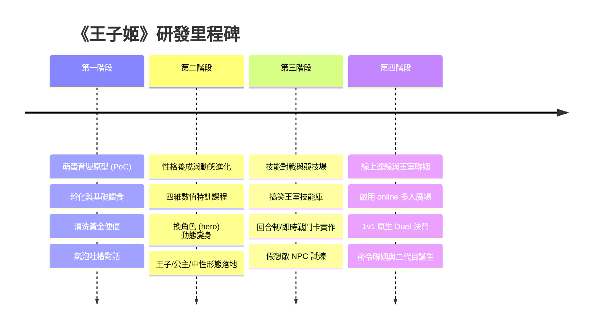

# 04. 開發里程碑與排程規劃

本文件規劃《王子姬》的分階段研發路線，依序從「單機可玩小原型（PoC）」逐步迭代至「多人連線宮廷爭霸」。

---

## 🗺️ 研發四階段路線圖

---

## 詳細階段目標

### 第一階段：萌蛋育嬰原型（PoC，1~2 週）
- [x] 建立 Larch 專案基底（名稱：`王子姬 Prince Hime`，ID: `project-6516bec7-4053-4a7c-a45e-2d739be40b12`）。
- [ ] 繪製或選定「萌蛋」與「幼兒期糰子」的 16px/32px 行走圖與立繪。
- [ ] 搭建第 1 張地圖「皇家育嬰室（Nursery）」（設定為 `soloMaps`）。
- [ ] 實現 3 項電子雞核心循環：
  - 輕敲與撫摸（累積愛心氣泡）。
  - 餵食菜單（降低飢餓度）。
  - 黃金便便隨機生成與打掃收穫系統。
- [ ] 實現破殼孵化事件（從蛋換成小糰子主角）。

### 第二階段：性格特訓與動態進化（2~3 週）
- [ ] 設計「每日皇家功課表」互動選單（劍術練習 vs 宮廷禮儀 vs 哲學閱覽）。
- [ ] 建立四維變數矩陣（`pride`, `spoiled`, `might`, `charm`）。
- [ ] 製作少年期與成年期主角造型：
  - `hero_prince_valiant`（鐵血王子）
  - `hero_princess_rose`（薔薇姬）
  - `hero_monarch_dual`（雙面王姬）
- [ ] 實作「成年禮儀式」事件：依四維數值判定分支，調用 `hero` 步驟完成動態進化！

### 第三階段：王室戰鬥卡與宮廷競技場（2 週）
- [ ] 建立 RPG 戰鬥卡與敵人配置（戰鬥木人、皇家禁衛軍、傲慢的鄰國使節）。
- [ ] 註冊特色技能庫（黃金湯匙敲擊、皇家傲嬌宣講、天降黃金炸彈）。
- [ ] 建立戰鬥介面美化（`battleUi: { preset: "parchment" }`）。
- [ ] 測試戰鬥勝利後獲得金幣、榮譽點數與稀有裝備掉落。

### 第四階段：線上連線大廳、決鬥與密令聯姻（2~3 週）
- [ ] 搭建連線大地圖「王城中央廣場（Royal Plaza）」。
- [ ] 配置 `larch_rpg_settings`：
  - `online.enabled = true`
  - `online.social.duel = true`（開啟同圖 1v1 玩家決鬥）
  - 聊天頻道與預設快捷語設定。
- [ ] 實現「皇家大教堂」之「王室婚約密碼（Gene Code）」生成與輸入兌換功能（`action.kind: "input"`）。
- [ ] 進行全服測試與試玩發布。
