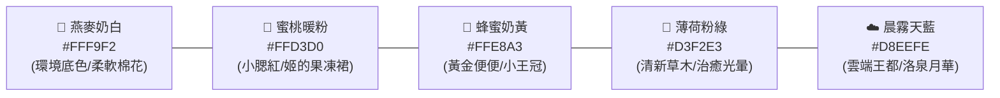

# 05. 極致療癒童話美術風格指南 (Ultra-Healing & Cozy Art Guide)

> **核心視覺信條**：每一個像素、每一抹色彩、每一次身體晃動，都要傳遞出極致的放鬆、溫暖與被治癒感。

《王子姬 Prince Hime》拒絕焦慮感與冰冷銳利感，整體視覺定位為**「繪本風暖心童話 × 晶瑩果凍軟糖（Storybook Cozy × Jelly Sweet）」**。

> **2026-10-06 拍板（實測後改定，以本節為準，與下文衝突時照這裡）**
>
> - **角色畫法**：光澤 Q 版、星星眼、張嘴笑、粉腮紅，參考 `assets/concept/style-test-1.webp`。王冠可以有尖，但尖端要收成圓珠。
> - **地圖小人用不透明的奶白果凍**：身體是珍珠奶白（像大福、麻糬），只靠頂部高光加邊緣珍珠虹彩暗示果凍感。本機 larch-preview 實測三種版本：不透明版最可愛；七成不透明版在地圖尺寸跟不透明版分不出差別；真透明版像肥皂泡，眼睛浮在空中、腮紅透成橄欖綠，最不療癒，放到白地毯上還會消失。
> - **透明感只放在大圖**：封面、對話立繪、劇情 CG 可以畫通透的果凍光影，地圖小人不做。
> - **日常樸素，特別時刻才華麗**：育嬰室這類日常場景維持本文的低飽和暖色，寵物是畫面最亮的焦點；金碧輝煌只留給成年禮、競技場、解鎖新造型。
> - **底層世界保持中性**：雲端王都不畫成歐式宮廷，也不畫成中式。漢代（三泉）、現代（格莉奇）的聯動一律當作「聯動造型」放進皇家穿衣鏡，每套配色要一眼分得出來（飛將紅、關刀綠、洛神銀藍）。
> - **小人規格（實測，2026-10-08 更正）**：引擎顯示寬度＝`sprite.scale` 格，跟原圖幾 px 無關（先前記成「跟原圖尺寸與 scale 都有關、約一格半」是錯的，實際是 3 格寬、身體約兩格，放大後糊）。1920 寬視窗一格約 80 螢幕 px，引擎不做平滑，所以圖寬要等於「scale × 80」，1 px 對 1 px 才清楚。現行：身體約一格寬，平常那隻 116px 配 1.45 格。去背用綠幕。


---

## 一、 色彩哲學：馬卡龍與舒芙蕾暖調

避免高飽和度的刺眼螢光色或陰暗髒污的死灰黑，全遊戲採用**低飽和、高明度、溫潤柔和的糕點糖果色盤**：



- **果凍原質的光影表現**：
  - 角色並非純色塊，而是自帶「手作琥珀糖」與「荔枝果凍」的高級通透感。
  - 受光面帶有一抹柔和的米白高光，邊緣則透出如彩虹糖紙般的微弱柔光（Subsurface Scattering 散射質感）。

---

## 二、 造型語言：圓滾滾、零銳角與麻糬回彈

在《王子姬》的世界裡，沒有任何會刺傷人的尖角：

1. **輪廓法則（Chubby & Round）**：
   - 角色、家具、道具一律採取**圓弧倒角（Puffy Silhouettes）**。
   - 小王冠不是鋒利的金屬刺，而是圓鈍小巧、像奶油蛋糕裝飾餅乾般的微型王冠。
   - 即使是神兵（方天戟、偃月刀、丈八蛇矛），刃尖也處理得像打磨過的玉石或糖藝武器，威武但充滿童話 Q 萌感。
2. **動作手感（Squash & Stretch - 麻糬物理）**：
   - **呼吸**：站著不動時，身體會像剛出爐的舒芙蕾一樣，極其輕柔地上下起伏呼吸。
   - **戳戳**：手指點擊時，整個身體不是生硬僵直，而是像剛蒸好的麻糬一樣「Duang~」地陷下去，再充滿彈性地鼓起來，伴隨水汪汪瞇眼笑。
   - **行走**：小王冠會根據彈跳節奏左右輕晃，像踩在彈簧床上一樣富有律動。

---

## 三、 場景意境：告別生硬網格，全幅手繪童話插畫地圖

> **技術原則**：**不使用官方內建的方塊磁磚（如 Kenney 16px 拼貼）！** 拼貼磁磚的直角邊界與重複紋理會帶來強烈的「生硬感與機械感」。本作全面改用 **Larch 的整張手繪插畫底圖（`settings.picture`）** 技術。

整個房間是一幅一體成型的精緻水彩童話插畫：地毯是不規則邊緣的蓬鬆雲朵、窗框是帶著自然弧度的手作暖木、陽光灑下柔和斑駁的光影，完全沒有任何 16×16 的方格感！

```
+-------------------------------------------------------+
|  [天邊棉花糖雲朵與彩虹]            [星星造型柔光夜燈] |
|                                                       |
|        [不規則邊緣的蓬鬆雲朵羊毛地毯]                 |
|                                                       |
|       ( o . o ) 👑  <-- 正在睡午覺的 QQ 史萊姆        |
|        (  QQ  )         (鼻尖冒出彩色小泡泡)          |
|                                                       |
|  [暖暖的圓角橡木小搖籃]         [晶亮金平糖黃金便便]  |
|  [毛絨線球玩具箱]               (拾起冒出金黃星屑)    |
+-------------------------------------------------------+
```

- **隱形自然碰撞**：只在阻擋物（如搖籃、外牆）鋪設 `visible: false` 的隱形碰撞層，視覺上只有極致柔和的手繪畫卷。
- **地毯與陳設**：踩上去宛如走在剛曬過太陽的羊毛被上，木質家具皆為溫暖的淺蜂蜜橡木。

- **「黃金便便」的療癒化**：
  - 徹底告別寫實便便的髒感！王子姬拉出的是像**「金平糖（Konpeito）」或「蜂蜜硬糖」**一樣晶瑩剔透的小八角星金球。
  - 清理時不會有蒼蠅或臭氣，而是發出「啵叮~」的清脆水晶音效，散開幾顆金黃色星屑粒子，直接變成可兌換金幣的糖果幣！

---

## 四、 Larch RPG 引擎環境光影最佳設定

利用 Larch 官方 RPG 地圖的 `environment` 參數，營造如沐春風的午後丁達爾光效：

```json
{
  "environment": {
    "weather": "clear",
    "darkness": 0,
    "ambience": {
      "particles": "sparkles",
      "density": 0.35,
      "rays": 0.55,
      "tint": "#FFF7EE",
      "tintStrength": 0.25,
      "critters": "butterflies",
      "glow": true
    }
  }
}
```

- **`rays: 0.55`**：柔和的午後陽光（丁達爾暖光柱）從窗外傾瀉在木地板上。
- **`particles: "sparkles"`**：空氣中漂浮著微小溫暖的金色光塵。
- **`critters: "butterflies"`**：偶爾有幾隻自帶微光的七彩小蝴蝶在房間輕盈起舞，小史萊姆還會好奇地歪頭看著它們。

---

## 五、 音樂與聽覺觸感（ASMR 級療癒）

- **背景音樂 (BGM)**：
  - 育嬰室精選 Larch 內建曲目：**`dewdrops` (Dewdrop Heart)** 或 **`goodnight` (Moonhorn Goodnight)**，溫柔的八音盒搭配尼龍弦吉他，心率瞬間平靜。
- **互動音效 (SFX)**：
  - 走路：輕快的「啵啾、啵啾（Puchu）」果凍彈跳聲。
  - 摸頭：軟綿綿的氣流「呼啾~」聲與親暱的「唧咿~」。
  - 飽餐：心滿意足的「呼姆~」滿足嘆息，頭頂冒出粉紅小愛心氣泡。
